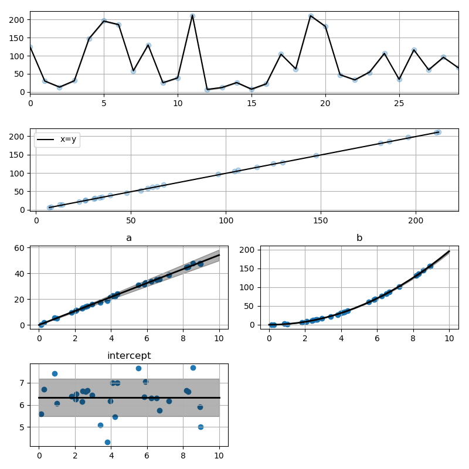
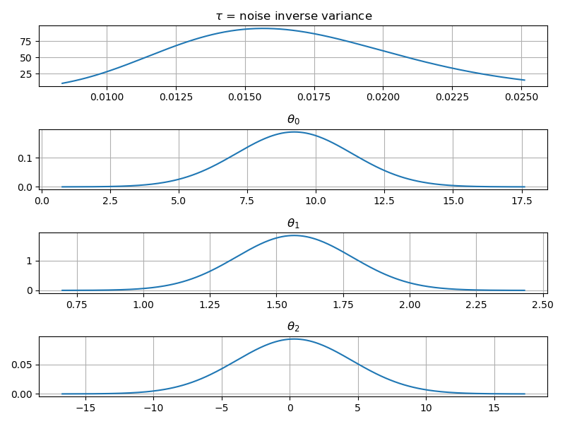
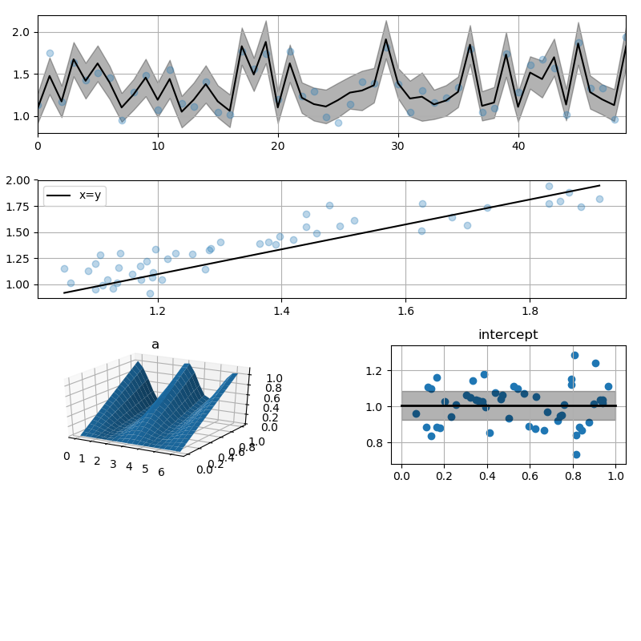
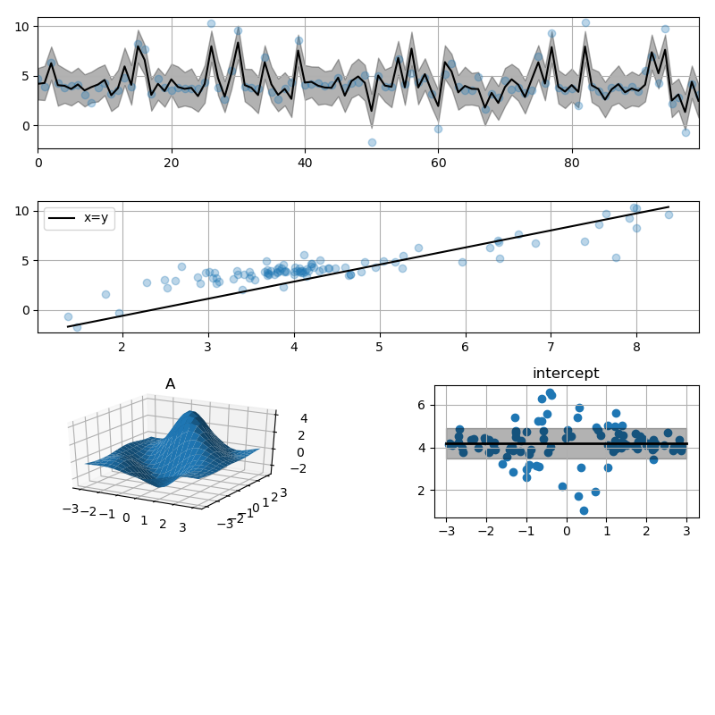
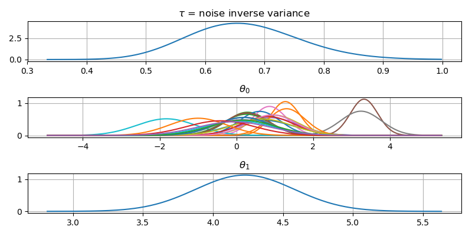
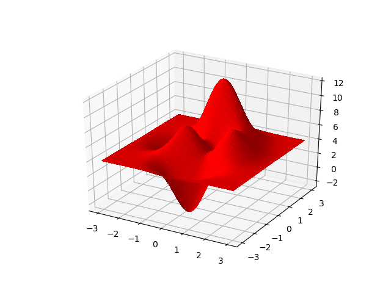
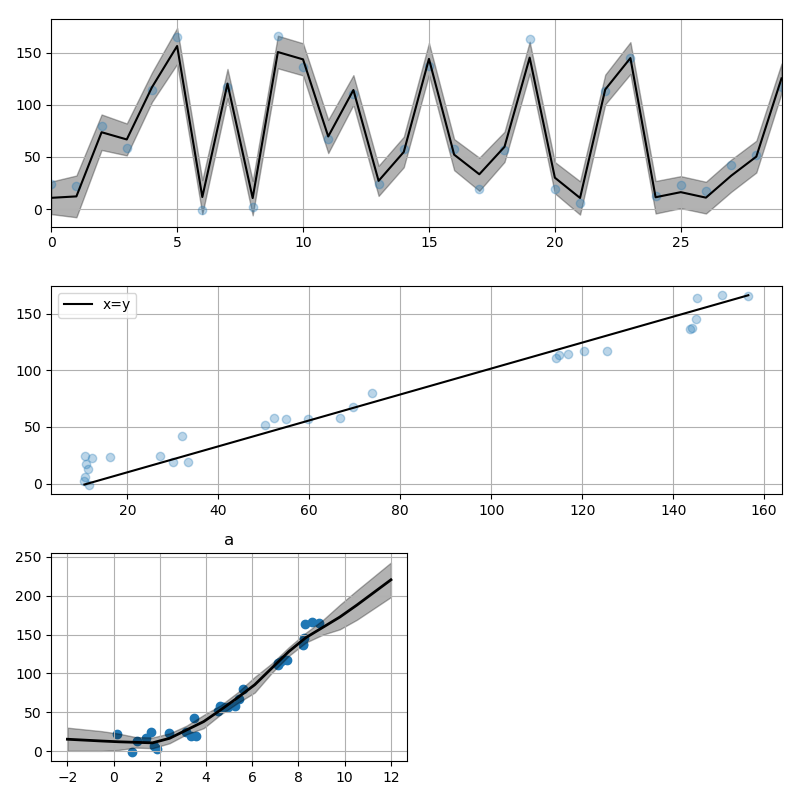
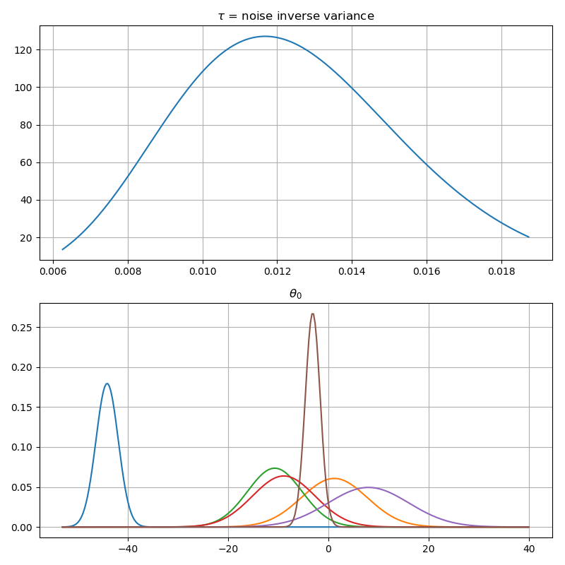

# Gammy – Generalized additive models in Python with a Bayesian twist

Generalized additive model is a predictive model which is defined
as a sum of terms which are calibrated using observation data. This
package provides a hopefully pleasant interface for configuring and fitting
such models. Bayesian interpretation of model parameters is promoted.


## Summary

Generalized additive models provide a surprisingly general framework for
building predictive models for both production software and research work.
This module provides tools for building the model terms as decompositions
of various basis functions. It is possible to model the terms as
Gaussian processes (with reduced dimensionality) of various kernels and
piecewise linear functions. Of course, very simple terms like lines and
constants are also supported (these are just very simple basis functions).

The uncertainty in the weight parameter distributions is modeled using
Bayesian statistic with the help of the superb package [BayesPy](http://www.bayespy.org/index.html).

The work is in very early stage, so many features are still missing.


### Projects with GAM functionalities

- [PyGAM](https://pygam.readthedocs.io/en/latest/)
- [Statsmodels](https://www.statsmodels.org/dev/gam.html)


## Examples

### Polynomial regression on 'roids

Start with very simple dataset

```python
import matplotlib.pyplot as plt
import numpy as np
import pandas as pd

import gammy
from gammy.utils import pipe
from gammy.keyfunction import x


np.random.seed(42)


# Define dummy data
n = 30
input_data = 10 * np.random.rand(n)
y = (
    5 * input_data +
    2.0 * input_data ** 2 +
    7 +
    10 * np.random.randn(len(input_data))
)
```

The object `x` is just a convenience tool for defining input data maps
as if they were just Numpy arrays.

```python
# Define model
a = gammy.Scalar(prior=(0, 1e-6))
b = gammy.Scalar(prior=(0, 1e-6))
intercept = gammy.Scalar(prior=(0, 1e-6))
formula = a * x + b * x ** 2 + intercept
model = gammy.BayesianGAM(formula).fit(input_data, y)
```

The model attribute `model.theta` characterizes the Gaussian posterior distribution of the model parameters vector.

#### Predicting with model

```python
model.predict(input_data[:3])
# array([  99.25493083,   23.31063443,  226.70702106])
```

Predictions with uncertainty can be calculated as follows (`scale=2.0` roughly corresponds to the 95% confidence interval):

```python
model.predict_total_uncertainty(input_data[:3], scale=2.0)
# (array([ 97.3527439 ,  77.79515549,  59.88285762]),
#  array([ 2.18915289,  2.19725385,  2.18571614]))
```

#### Plotting results

```python
# Plot results
fig = gammy.plot.validation_plot(
    model,
    input_data,
    y,
    grid_limits=[0, 10],
    input_maps=[x, x, x],
    titles=["a", "b", "intercept"]
)
```

The grey band in the top figure is two times
the prediction standard deviation and, in the partial residual plots, two times
the respective marginal posterior standard deviation.



It is also possible to plot the estimated Γ-distribution of the noise precision
(inverse variance) as well as the 1-D Normal distributions of each individual
model parameter.

```python
# Plot parameter probability density functions
fig = gammy.plot.gaussian1d_density_plot(model, grid_limits=[-1, 3])
```


#### Saving model on hard disk for later use (HDF5)

Saving

```python
model.save("/home/foobar/test.hdf5")
```

Loading

```python
model = BayesianGAM(formula).load("/home/foobar/test.hdf5")
```

### Gaussian process regression ("kriging")

```python
# Create some data
n = 50
input_data = np.vstack(
    (
        2 * np.pi * np.random.rand(n),
        np.random.rand(n),
    )
).T
y = (
    np.abs(np.cos(input_data[:, 0])) * input_data[:, 1] +
    1 +
    0.1 * np.random.randn(n)
)


# Define model
a = gammy.ExpSineSquared1d(
    np.arange(0, 2 * np.pi, 0.1),
    l=1.0,
    sigma=1.0,
    period=2 * np.pi,
    energy=0.99
)
intercept = gammy.Scalar(prior=(0, 1e-6))
formula = a(x[:, 0]) * x[:, 1] + intercept
model = gammy.BayesianGAM(formula).fit(input_data, y)


# Plot results
fig = gammy.plot.validation_plot(
    model,
    input_data,
    y,
    grid_limits=[[0, 2 * np.pi], [0, 1]],
    input_maps=[x[:, 0:2], x[:, 1]],
    titles=["a", "intercept"]
)


# Plot parameter probability density functions
fig = gammy.plot.gaussian1d_density_plot(model, grid_limits=[-1, 3])
```




### Multivariate Gaussian process regression

In this example we construct a basis corresponding to a multi-variate
Gaussian process with a Kronecker structure (see e.g. [PyMC3](https://docs.pymc.io/notebooks/GP-Kron.html)).

Let us first create some artificial data using the MATLAB function!

```python
# Create some data
n = 100
input_data = np.vstack(
    (
        6 * np.random.rand(n) - 3,
        6 * np.random.rand(n) - 3,
    )
).T

def peaks(x, y):
    """The function in Mathworks logo

    """
    return (
        3 * (1 - x) ** 2 * np.exp(-(x ** 2) - (y + 1) ** 2) -
        10 * (x / 5 - x ** 3 - y ** 5) * np.exp(-x ** 2 - y ** 2) -
        1 / 3 * np.exp(-(x + 1) ** 2 - y ** 2)
    )

y = peaks(input_data[:, 0], input_data[:, 1]) + 4 + 0.3 * np.random.randn(n)
```

There is support for forming two-dimensional basis functions given two
one-dimensional formulas. The new combined basis is essentially the outer
product of the given bases. The underlying weight prior distribution priors and
covariances are constructed using the Kronecker product.


```python
# Define model
a = gammy.ExpSquared1d(
    np.arange(-3, 3, 0.1),
    l=0.5,
    sigma=4.0,
    energy=0.99
)(x[:, 0])  # note that we need to define the input map at this point!
b = gammy.ExpSquared1d(
    np.arange(-3, 3, 0.1),
    l=0.5,
    sigma=4.0,
    energy=0.99
)(x[:, 1]) # note that we need to define the input map at this point!
A = gammy.Kron(a, b)
intercept = gammy.Scalar(prior=(0, 1e-6))
formula = A + intercept
model = gammy.BayesianGAM(formula).fit(input_data, y)
```

Note that same logic could be used to construct higher dimensional bases,
that is, one could define

```python
# 3-D formula
formula = gammy.kron(gammy.kron(a, b), c)
```

Finally, plot results.


```python
# Plot results
fig = gammy.plot.validation_plot(
    model,
    input_data,
    y,
    grid_limits=[[-3, 3], [-3, 3]],
    input_maps=[x, x[:, 0]],
    titles=["A", "intercept"]
)


# Plot parameter probability density functions
fig = gammy.plot.gaussian1d_density_plot(model, grid_limits=[-1, 3])
```




The original function can be plotted like so

```python
from mpl_toolkits.mplot3d import Axes3D


X, Y = np.meshgrid(np.linspace(-3, 3, 100), np.linspace(-3, 3, 100))
Z = peaks(X, Y) + 4

fig = plt.figure()
ax = fig.gca(projection="3d")
ax.plot_surface(X, Y, Z, color="r", antialiased=False)
# ax.scatter3D(input_data[:, 0], input_data[:, 1], y)
```




### B-Spline basis

Constructing B-Spline based 1-D basis functions is also supported.

```python
# Define dummy data
input_data = 10 * np.random.rand(30)
y = (
    2.0 * input_data ** 2 +
    7 +
    10 * np.random.randn(len(input_data))
)


# Define model
a = gammy.Scalar(prior=(0, 1e-6))

grid = np.arange(0, 11, 2.0)
order = 2
N = len(grid) + order - 2
sigma = 10 ** 2
a = gammy.BSpline1d(
    grid,
    order=order,
    prior=(np.zeros(N), np.identity(N) / sigma),
    extrapolate=True
)
formula = a(x)
model = gammy.BayesianGAM(formula).fit(input_data, y)

# Plot results
fig = gammy.plot.validation_plot(
    model,
    input_data,
    y,
    grid_limits=[-2, 12],
    input_maps=[x],
    titles=["a"]
)


# Plot parameter probability density functions
fig = gammy.plot.gaussian1d_density_plot(model, grid_limits=[-1, 3])
```





## To-be-added features

- **TODO** Fixed ordering for GP related basis functions.
- **TODO** Hyperpriors for model parameters – Start from diagonal precisions.
           Instead of `(μ, Λ)` pairs, the arguments could be just
           BayesPy node.
- **TODO** Add simple Numpy-based linear solver for MAP estimates.
- **TODO** Support non-linear GAM models.
- **TODO** Multi-dimensional observations.
- **TODO** Dynamically changing models.
