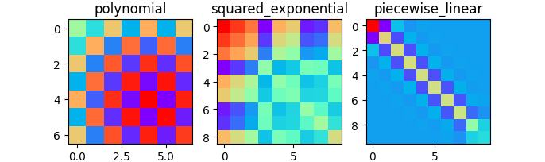

# Gammy – Generalized additive models in Python with a Bayesian twist


A Generalized additive model is a predictive mathematical model defined as a sum
of terms that are calibrated (fitted) with observation data. 

Generalized additive models form a surprisingly general framework for building
models for both production software and scientific research. This Python package
offers tools for building the model terms as decompositions of various basis
functions. It is possible to model the terms e.g. as Gaussian processes (with
reduced dimensionality) of various kernels, as piecewise linear functions, and
as B-splines, among others. Of course, very simple terms like lines and
constants are also supported (these are just very simple basis functions).

The uncertainty in the weight parameter distributions is modeled using Bayesian
statistical analysis with the help of the superb package
[BayesPy](http://www.bayespy.org/index.html). Alternatively, it is possible to
fit models using just NumPy.

<!-- markdown-toc start - Don't edit this section. Run M-x markdown-toc-refresh-toc -->
**Table of Contents**

- [Installation](#installation)
- [Key features](#key-features)
    - [Intuitive interface for defining additive models](#intuitive-interface-for-defining-additive-models)
    - [Collection of constructors like Gaussian processes and Splines](#collection-of-constructors-like-gaussian-processes-and-splines)
    - [Bayesian statistics and confidence intervals](#bayesian-statistics-and-confidence-intervals)
    - [Term composition framework](#term-composition-framework)
    - [Non-linear manifold regression](#non-linear-manifold-regression)
- [Package documentation](#package-documentation)

<!-- markdown-toc end -->


## Installation

The package is found in PyPi.

``` shell
pip install gammy
```


## Key features

In this overview, we demonstrate the package's most important features through
common usage examples. Import the bare minimum dependencies to be used in the
below examples:

``` python
import matplotlib.pyplot as plt
import numpy as np

import gammy
from gammy.arraymapper import x, lift
from gammy.bayespy import GAM
from gammy.formulae import (
    Polynomial, 
    ExpSquared1d, 
    WhiteNoise1d, 
    Scalar,
    Function
)
```

A typical simple (but sometimes non-trivial) modeling task is to estimate an
unknown function from noisy data. Let's simulate a fake case:

``` python
# Simulate data
input_data = np.linspace(0.01, 1, 50)
y = 1.3 + np.sin(1 / input_data) * np.exp(input_data) + 0.1 * np.random.randn(50)
```

### Intuitive interface for defining additive models

The starting point could be defining a simple additive model. A Gammy model can
be instantiated on the fly by algebraic operations of simpler terms. Below `x`
is a **convenience tool (function) for mapping inputs** (see `gammy.arraymapper.x`):

``` python
# A totally non-sense model, just an example
bias = Scalar()
slope = Scalar()
k = Scalar()
formula = bias + slope * x + k * x ** (1/2)
model_bad = GAM(formula).fit(input_data, y)
```

Custom terms can be defined in terms of any function basis, that is, a `list` of
functions:

``` python
# Custom function basis
basis = [lambda t: np.sin(1 / t) * np.exp(t), lambda t: np.ones(len(t))]

formula = gammy.Formula(
    terms=[basis],
    # mean and inverse covariance (precision matrix)
    prior=(np.zeros(2), 1e-6 * np.eye(2))
)
model_ideal = GAM(formula).fit(input_data, y)

plt.scatter(input_data, y, c="r", label="data")
plt.plot(input_data, model_bad.predict(input_data), label="bad")
plt.plot(input_data, model_ideal.predict(input_data), label="ideal")
plt.legend()
```


Note that in higher dimensions we would need to use NumPy-indexing such as in

``` python
formula = gammy.Formula([lambda t: np.sin(t[:, 0]), lambda t: np.tanh(t[:, 1])])
```

and so on. Also, functional style transforms are supported:

``` python
sin = gammy.arraymapper.lift(np.sin)
tanh = gammy.arraymapper.lift(np.tanh)
formula = Scalar() * sin(x[:, 0]) + Scalar() * tanh(x[:, 1])
```

### Collection of constructors like Gaussian processes and Splines

We continue with the same artificial dataset. Below are some of the pre-defined
constructors that can be used for solving common function estimation problems.

``` python
models = {
    
    # Polynomial model
    "polynomial": GAM(
        Polynomial(order=6)(x)
    ).fit(input_data, y),
    
    # Smooth Gaussian process model
    "squared_exponential": GAM(
        Scalar() * x + 
        ExpSquared1d(np.arange(0, 1, 0.05), corrlen=0.1, sigma=2)(x)
    ).fit(input_data, y),
    
    # Piecewise linear model
    "piecewise_linear": GAM( 
        WhiteNoise1d(np.arange(0, 1, 0.1), sigma=1)(x)
    ).fit(input_data, y)

}
```

### Bayesian statistics and confidence intervals

Variance of additive zero-mean normally distributed noise is estimated automatically:

``` python
np.sqrt(models["polynomial"].inv_mean_tau)
# 0.10129...
```

Plot posterior predictive mean and 2-std confidence interval:

``` python
(fig, axs) = plt.subplots(1, 3, figsize=(8, 2))
for ((name, model), ax) in zip(models.items(), axs):
    # Posterior predictive mean and variance
    (μ, σ) = model.predict_variance(input_data)
    ax.scatter(input_data, y, color="r")
    ax.plot(input_data, model.predict(input_data), color="k")
    ax.fill_between(
        input_data, μ - 2 * np.sqrt(σ), μ + 2 * np.sqrt(σ), alpha=0.2
    )
    ax.set_title(name)
```


Since model parameters are Gaussian random variables, posterior covariance matrices can be easily calculated and visualised with the model:

``` python
(fig, axs) = plt.subplots(1, 3, figsize=(8, 2))
for ((name, model), ax) in zip(models.items(), axs):
    (ax, im) = gammy.plot.covariance_plot(model, ax=ax)
    ax.set_title(name)
```



### Term composition framework

It is straightforward to build custom additive model formulas in higher input
dimensions using the existing ones. For example, assume that we want to deduce a
bivariate function from discrete set of samples:

``` python
# #####################
# Monkey saddle surface
# #####################
n = 100
input_data = np.vstack(
    [2 * np.random.rand(n) - 1, 2 * np.random.rand(n) - 1]
).T
y = input_data[:, 0] ** 3 - 3 * input_data[:, 0] * input_data[:, 1] ** 2
```

Although this is a trivial example, it demonstrates the composability of model
terms:

``` python
model = GAM(
    # NOTE: Terms can be multiplied with input mappings and
    # concatenated by addition.
    Scalar() * x[:, 0] ** 3 + Scalar() * x[:, 0] * x[:, 1] ** 2
).fit(input_data, y)

model.mean_theta
# [array([1.]), array([-3.])]

# Root mean square error
residual = y - model.predict(input_data)
np.sqrt((residual ** 2).mean())
# 1.826197e-12
```

The model form can be relaxed with "black box" terms such as piecewise 
linear basis functions:

``` python
model = GAM(
    Polynomial(4)(x[:, 0]) + 
    WhiteNoise1d(np.arange(-1, 1, 0.05), sigma=1)(x[:, 1]) * x[:, 0]
).fit(input_data, y)
```

Let's check if the model was able to fit correctly:

``` python
fig = plt.figure(figsize=(8, 2))
(X, Y) = np.meshgrid(np.linspace(-1, 1, 100), np.linspace(-1, 1, 100))
Z = X ** 3 - 3 * X * Y ** 2
Z_est = model.predict(
    np.hstack([X.reshape(-1, 1), Y.reshape(-1, 1)])
).reshape(100, 100)
ax = fig.add_subplot(121, projection="3d")
ax.set_title("Exact")
ax.plot_surface(
    X, Y, Z, color="r", antialiased=False
)
ax = fig.add_subplot(122, projection="3d")
ax.set_title("Estimated")
ax.plot_surface(
    X, Y, Z_est, antialiased=False
)
```


### Non-linear manifold regression

In this example we try estimating the bivariate "MATLAB function" using a
Gaussian process model with Kronecker tensor structure. The main point in the
below example is that it is quite straightforward to build models that can learn 
arbitrary 2D-surfaces.

``` python
# Simulate data
n = 100
input_data = 6 * np.vstack((np.random.rand(n), np.random.rand(n))).T - 3
y = (
    # 'Peaks' function of Matlab logo: 
    # https://www.mathworks.com/help/matlab/ref/peaks.html
    gammy.peaks(input_data[:, 0], input_data[:, 1]) + 4 
    + 0.3 * np.random.randn(n)
)

# Define and fit the model
gaussian_process = gammy.ExpSquared1d(
    grid=np.arange(-3, 3, 0.1),
    corrlen=0.5,
    sigma=4.0,
    energy=0.9
)
bias = gammy.Scalar()
formula = gammy.Kron(gaussian_process(x[:, 0]), gaussian_process(x[:, 1])) + bias
model = gammy.models.bayespy.GAM(formula).fit(input_data, y)
```

The above Kronecker transformation generalizes to arbitrary dimension. The below plot is generated with `gammy.plot.validation_plot`. More information in the [Documentation](https://malmgrek.github.io/gammy/).


`

## Package documentation

A documentation of the package code together with more code examples and images:
<https://malmgrek.github.io/gammy>.

Links to various code examples:

- [Polynomial regression](https://malmgrek.github.io/gammy/walkthrough.html#polynomial-regression)
- [Gaussian process inference](https://malmgrek.github.io/gammy/walkthrough.html#one-dimensional-gaussian-process-models)
- [Spline inference](https://malmgrek.github.io/gammy/walkthrough.html#spline-regression)
- [Manifold regression](https://malmgrek.github.io/gammy/walkthrough.html#multivariate-formulae) of arbitrary dimension


<!-- ## To-be-added features -->

<!-- - **TODO** Quick model template functions (e.g. splines, GPs) -->
<!-- - **TODO** Shorter overview and examples in README. Other docs inside `docs`. -->
<!-- - **TODO** Support indicator models in plotting -->
<!-- - **TODO** Fixed ordering for GP related basis functions. -->
<!-- - **TODO** Hyperpriors for model parameters – Start from diagonal precisions. -->
<!--            Instead of `(μ, Λ)` pairs, the arguments could be just -->
<!--            BayesPy node. -->
<!-- - **TODO** Support non-linear GAM models. -->
<!-- - **TODO** Multi-dimensional observations. -->
<!-- - **TODO** Dynamically changing models. -->
