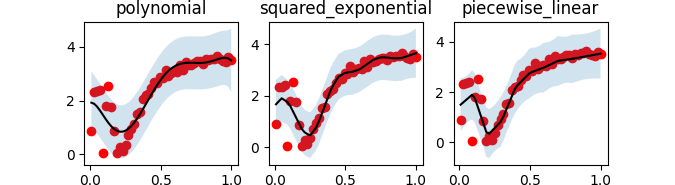

# Gammy – Generalized additive models in Python with a Bayesian twist


A Generalized additive model is a predictive mathematical model defined as a sum
of terms that are calibrated (fitted) with observation data. 

Generalized additive models form a surprisingly general framework for building
models for both production software and scientific research. This Python package
offers tools for building the model terms as decompositions of various basis
functions. It is possible to model the terms e.g. as Gaussian processes (with
reduced dimensionality) of various kernels, as piecewise linear functions, and
as B-splines, among others. Of course, very simple terms like lines and
constants are also supported (these are just very simple basis functions).

The uncertainty in the weight parameter distributions is modeled using Bayesian
statistical analysis with the help of the superb package
[BayesPy](http://www.bayespy.org/index.html). Alternatively, it is possible to
fit models using just NumPy.

## Key features

- Intuitive interface for constructing additive models.
- Collection of constructors such as Gaussian Processes and splines.
- Easily extensible term construction framework, 
- Build non-linear (w.r.t. inputs) models of arbitrary input dimension.
- Bayesian prior and posterior of model parameters.
- Statistics such as posterior means, covariances and confidence intervals.


## Documentation

A documentation of the package with a lot of code examples and plots:
<https://malmgrek.github.io/gammy>.

Short code examples:
- [Polynomial regression](https://malmgrek.github.io/gammy/walkthrough.html#polynomial-regression)
- [Gaussian process inference](https://malmgrek.github.io/gammy/walkthrough.html#one-dimensional-gaussian-process-models)
- [Spline inference](https://malmgrek.github.io/gammy/walkthrough.html#spline-regression)
- [Manifold regression](https://malmgrek.github.io/gammy/walkthrough.html#multivariate-formulae) of arbitrary dimension


## Installation

The package is found in PyPi.

``` shell
pip install gammy
```


## Quick overview

Import the bare minimum dependencies for later use:

``` python
import matplotlib.pyplot as plt
import numpy as np

import gammy
from gammy.arraymapper import x
```

### Simple example: Polynomial regression

A typical simple but non-trivial modeling task is to estimate an unknown function from noisy data.

``` python
# Simulate data
input_data = np.linspace(0.01, 1, 50)
y = np.sin(1 / input_data) * input_data + 0.1 * np.random.randn(50)

# Define and fit model
model = gammy.bayespy.GAM(gammy.Polynomial(order=6)).fit(input_data, y)
```

Automatically estimated noise level:

``` python
# Variance of additive zero-mean normally distributed noise is estimated
np.sqrt(model.inv_mean_tau)
# 0.10129...
```

Plot posterior predictive mean and 2σ-confidence interval:

``` python
# Posterior predictive mean and variance
(μ, σ) = model.predict_variance(input_data)

plt.scatter(input_data, y, color="r")
plt.plot(input_data, model.predict(input_data), color="k")
plt.fill_between(input_data, μ - 2 * np.sqrt(σ), μ + 2 * np.sqrt(σ), alpha=0.1)
```



### Estimating higher dimensional manifolds

In this example we try estimating the bivariate "MATLAB function" using
a Gaussian process model with Kronecker structure.

``` python
# Simulate data
n = 100
input_data = 6 * np.vstack((np.random.rand(n), np.random.rand(n))).T - 3
y = (
    gammy.peaks(input_data[:, 0], input_data[:, 1]) + 4 
    + 0.3 * np.random.randn(n)
)

# Define and fit the model
gaussian_process = gammy.ExpSquared1d(
    grid=np.arange(-3, 3, 0.1),
    corrlen=0.5,
    sigma=4.0,
    energy=0.9
)
bias = gammy.Scalar()
formula = gammy.Kron(gaussian_process(x[:, 0]), gaussian_process(x[:, 1])) + bias
model = gammy.models.bayespy.GAM(formula).fit(input_data, y)
```

The above Kronecker transformation generalizes to arbitrary dimension. The below plot is generated with `gammy.plot.validation_plot`:


`

<!-- ## To-be-added features -->

<!-- - **TODO** Quick model template functions (e.g. splines, GPs) -->
<!-- - **TODO** Shorter overview and examples in README. Other docs inside `docs`. -->
<!-- - **TODO** Support indicator models in plotting -->
<!-- - **TODO** Fixed ordering for GP related basis functions. -->
<!-- - **TODO** Hyperpriors for model parameters – Start from diagonal precisions. -->
<!--            Instead of `(μ, Λ)` pairs, the arguments could be just -->
<!--            BayesPy node. -->
<!-- - **TODO** Support non-linear GAM models. -->
<!-- - **TODO** Multi-dimensional observations. -->
<!-- - **TODO** Dynamically changing models. -->
